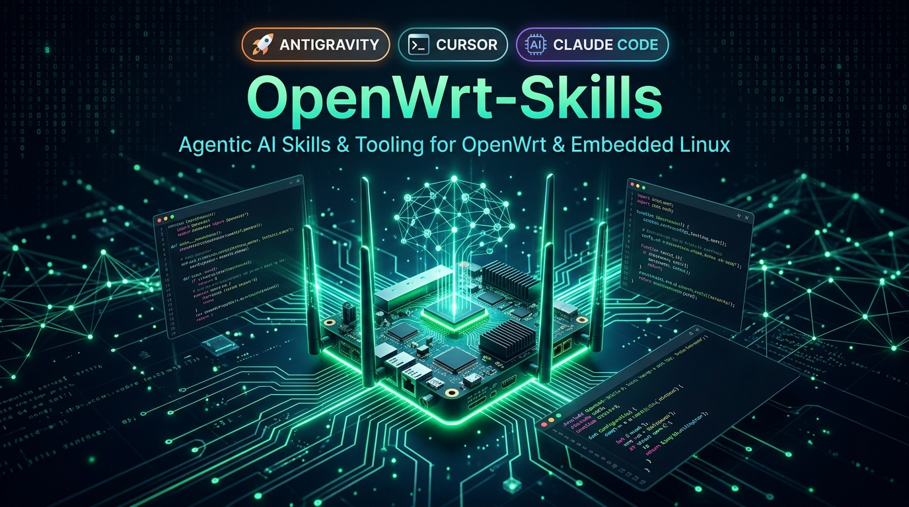

<p align="center">
  
</p>

# OpenWrt-Skills 🌐🤖

> **The Definitive Agentic AI Skills, Rules & Tooling Suite for OpenWrt & LuCI Development.**  
> Built for embedded networking, low-footprint hardware (16 MB SPI Flash / 128–256 MB RAM), and OpenWrt systems with `fw3`/`iptables` or `fw4`/`nftables`, and `opkg` or `apk`.

> **Keywords / SEO**: OpenWrt AI skills, Google Antigravity OpenWrt, Cursor rules OpenWrt, Claude Code embedded Linux, LuCI UI development, BusyBox ash scripting, nftables firewall4, CAKE bufferbloat OpenWrt, embedded Linux developer tools.

[](https://openwrt.org)
[](https://github.com/Despensativo/OpenWrt-Skills)
[](https://github.com/Despensativo/OpenWrt-Skills)
[](LICENSE)

---

## 📖 Overview

**OpenWrt-Skills** equips modern AI coding assistants (Google Antigravity, Cursor AI, Claude Code, Windsurf, Roo Code, ChatGPT) with deep, production-grade domain knowledge of OpenWrt firmware engineering, embedded POSIX shell scripting, LuCI web user interface design, and kernel networking.

### Why OpenWrt-Skills?
Developing for resource-constrained routers (e.g. 16 MB SPI Flash and 128 MB RAM) is unforgiving:
* Standard LLMs hallucinate non-existent bashisms (`[[ ]]`, `${var//}`) that crash BusyBox ash.
* Generic code writes large logs to `/etc`, exhausting the writable `/overlay` partition and bricking the router.
* Frontend code uses heavy npm libraries and synchronous `alert()`, freezing the LuCI event loop on mobile phones.
* Firewall scripts assume `iptables` and fail on default OpenWrt 22.03+ images running `nftables` (`firewall4`).

These skills provide checks and patterns; validate each change against the target device and firmware.

---

## 🧩 The 11 Specialized Agent Skills

Each skill has YAML frontmatter. `skills/` is the maintained source; `.agents/skills/` is a mirrored copy for tools that discover that path. Run `python scripts/check_skill_mirrors.py` after editing a skill.

| # | Skill Name | Domain & Scope | Key Capabilities |
| :---: | :--- | :--- | :--- |
| 1 | **[`posix-shell`](skills/posix-shell/SKILL.md)** | BusyBox ash & Shell Compliance | Forbids bashisms, enforces safe variable quoting, atomic UCI batch commits, memory efficiency. |
| 2 | **[`security-auditor`](skills/security-auditor/SKILL.md)** | Embedded Security & RPC ACLs | Command injection prevention in `sys.exec`, ubus ACL auditing, ephemeral tokens in `/tmp`. |
| 3 | **[`systematic-debugging`](skills/systematic-debugging/SKILL.md)** | Root-Cause Diagnostics | Enforces log analysis (`dmesg`, `logread`, `ubus status`) before proposing any code edits. |
| 4 | **[`openwrt-network-firewall`](skills/openwrt-network-firewall/SKILL.md)** | Dual Firewall & DSA Switch | Dynamic detection of `fw3`/`iptables` vs `fw4`/`nftables`, DSA bridge VLAN filtering, anti-lockout safety. |
| 5 | **[`ark-theme-ui`](skills/ark-theme-ui/SKILL.md)** | LuCI Mobile UI & Theming | 40px touch targets, `.main-right` scroll lock, modal backdrop decoupling, esbuild asset minification (<60 KB). |
| 6 | **[`openwrt-imagebuilder`](skills/openwrt-imagebuilder/SKILL.md)** | Custom Firmware Compilation | Exact 16 MB Flash partition budgeting, package manifests, zero-waste `/overlay`, Cudy SPI flash revisions. |
| 7 | **[`openwrt-hardware-offloading`](skills/openwrt-hardware-offloading/SKILL.md)** | Silicon Acceleration | MediaTek PPE (Packet Processing Engine) + WED (Wireless Ethernet Dispatch) vs Qualcomm NSS, SQM conflicts. |
| 8 | **[`openwrt-wifi-mesh`](skills/openwrt-wifi-mesh/SKILL.md)** | Roaming & 802.11s Mesh | 802.11r/k/v Fast Transition, lightweight `usteer` band steering (-73 dBm threshold), SAE mesh backhaul. |
| 9 | **[`openwrt-sqm-bufferbloat`](skills/openwrt-sqm-bufferbloat/SKILL.md)** | CAKE & Latency Mitigation | CAKE (`piece_of_cake.qos`), multi-core considerations, framing overhead, and measured latency under load. |
| 10 | **[`openwrt-storage-failsafe`](skills/openwrt-storage-failsafe/SKILL.md)** | MTD & Unbrick Recovery | `/proc/mtd` partition tables, `factory`/ART backup preservation, Telnet Failsafe mode, U-Boot TFTP rescue. |
| 11 | **[`openwrt-luci-modern`](skills/openwrt-luci-modern/SKILL.md)** | Modern LuCI Client-Side JS | Pure JS views (`L.view.extend`), `E()` DOM builder, JSON menus, RPC ACLs, no legacy Lua CBI. |

---

## 🛠️ Table of Hardware (ToH) Offline Query Tool

Included in `scripts/openwrt_hardware_query.py`, this tool queries a local compressed database (`data/openwrt_toh_cache.json.gz`) of **3,030 official OpenWrt devices** across 74 attributes.

### CLI Usage
```bash
# Query any router model (instant offline search)
python scripts/openwrt_hardware_query.py "Cudy WR3000"

# Query by brand, SoC, or architecture
python scripts/openwrt_hardware_query.py "Archer C7"
python scripts/openwrt_hardware_query.py "filogic"
```

### Automatic Channel Width Deduction (80 MHz vs 160 MHz)
The query tool analyzes chipset combinations (e.g. MediaTek MT7981 + MT7976C) to accurately report Wi-Fi 6 channel capabilities (`HE160` vs `HE80` vs `VHT80`) along with stock vs sysupgrade installation methods.

---

## 🛡️ Master AI Reviewer Prompt

Need a second opinion on a pull request, shell script, or LuCI modification?  
We include a battle-tested master reviewer prompt in [`docs/PROMPT-REVISOR-MESTRE-IA.md`](docs/PROMPT-REVISOR-MESTRE-IA.md).

Paste this prompt into Claude, ChatGPT, or Gemini before submitting code to enforce:
1. Flash & RAM budget impact analysis.
2. Dual OpenWrt generation compatibility (`fw3` vs `fw4`, `opkg` vs `apk`).
3. POSIX shell verification (no bashisms).
4. Mobile-first LuCI DOM containment (`min-width: 0`, 40px touch).
5. Anti-lockout and brick risk assessment.

---

## 🚀 Installation & Integration

### Google Antigravity / Gemini CLI
Clone or copy the skills into your workspace:
```bash
cp -r .agents/skills/ /path/to/your/workspace/.agents/skills/
```

### Cursor AI
Copy a relevant `SKILL.md` into your project's Cursor rules or adapt its instructions to your existing rule format. `AGENTS.md` describes this project's workflow; it is not a drop-in `.cursorrules` file.

### Claude Code / Windsurf / Roo Code / Cline
Simply point your agent workspace to `skills/` or `.agents/skills/`. All `SKILL.md` files feature standard YAML frontmatter recognized automatically by agentic frameworks.

---

## 📜 Architectural Directives Summary

1. **Hardware Budget**: Maintain more than 2 MB free on `/overlay`. Keep compressed theme assets below 60 KB.
2. **Runtime Detection**: Detect the active package manager and firewall service. Default OpenWrt 24.10 and older use `opkg`; 25.12 and newer use `apk`. Default 22.03 and newer images use `fw4`, but verify the device rather than inferring from its release.
3. **Touch Targets**: Minimum 40px useful height for buttons, badges, and toggles.
4. **Scroll Isolation**: Trapping scroll in LuCI requires locking `.main-right`, not `body`.
5. **No Synchronous Popups**: Never use `alert()` or `confirm()`.
6. **Git Hygiene & Zero Binary Bloat**: Never commit compiled firmware images (`.bin`, `.img`, `.iso`, full toolchains) or OpenWrt build trees (`bin/`, `build_dir/`, `staging_dir/`) to Git. Publish compiled sysupgrade artifacts, packages and rootfs dumps exclusively via **GitHub Releases** (up to 2 GB per file) or CI pipelines. Keep repositories well within GitHub Free account guidelines (< 1 GB soft limit, 100 MB single-file hard limit).

### Lessons from ARK Router

[`docs/ARK-ROUTER-LESSONS.md`](docs/ARK-ROUTER-LESSONS.md) records reusable findings from the ARK Router implementation, with source pointers and limits on what has actually been verified. It covers RAM caches, LuCI layout, Wi-Fi safety, multi-WAN status, SQM, and release evidence.

---

## 🤝 Contributing

Contributions, bug reports, and new hardware profiles are welcome! Feel free to open an issue or submit a pull request.

## 📄 License

Distributed under the [MIT License](LICENSE).
